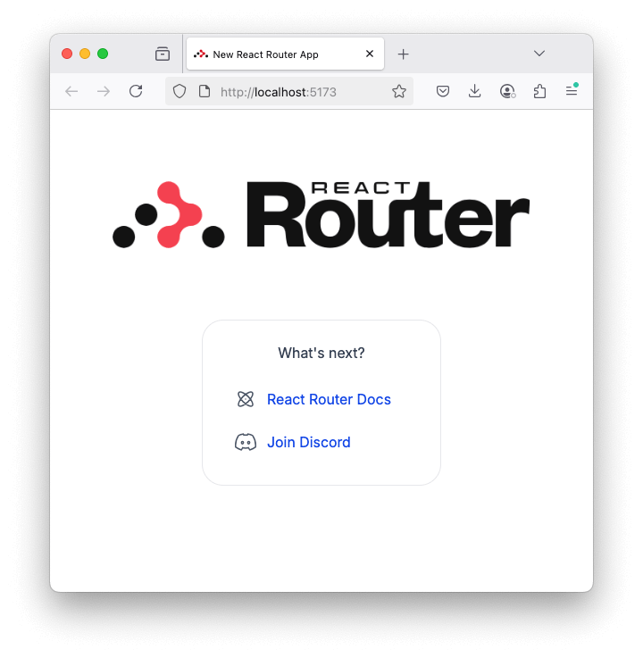

# Step 1: Create a new Remix app

[^ From Scratch](./step-00-from-scratch.md)

- <https://github.com/richplastow/tryout-remix-material-ui/blob/main/docs/from-scratch/step-01-create-a-new-remix-app.md>

---

First, read React Router's
['Decision Advice'](https://reactrouter.com/start/modes#decision-advice)
to decide which of the 3 modes to use. tryout-remix-material-ui uses the
'Framework' mode:  
<https://reactrouter.com/start/framework/installation>

## Step 1-1: Run the 'default' `npx` installation

There are about a dozen official templates available:  
<https://github.com/remix-run/react-router-templates/tree/main>

```bash
# Install using the default template.
npx create-react-router@latest --template remix-run/react-router-templates/default
# Need to install the following packages:
# create-react-router@7.6.2
# Ok to proceed? (y)
y
# 
# npm warn deprecated inflight@1.0.6: This module is not supported, and leaks memory ...
# npm warn deprecated glob@7.2.3: Glob versions prior to v9 are no longer supported
# 
#          create-react-router v7.6.2
# 
#    dir   Where should we create your new project?
.
# 
#       ◼  Template: Using remix-run/react-router-templates/default...
#       ✔  Template copied
# 
#  overwrite   Your project directory contains files that will be overwritten by
#              this template (you can force with `--overwrite`)
# 
#              Files that would be overwritten:
#                .gitignore
#                README.md
# 
#              Do you wish to continue?
#              
Yes
#       ◼  Nice! Git has already been initialized
# 
#   deps   Install dependencies with npm?
Yes
# 
#       ✔  Dependencies installed
# 
#   done   That's it!
#          Check out README.md for development and deploy instructions.
# 
#          Join the community at https://rmx.as/discord
```

<!-- node_modules/ is 119,042,700 bytes (136.8 MB on disk) for 6,735 items -->

Store Remix's default README.md and .gitignore for future reference, and use
a more comprehensive .gitignore instead.

```bash
# Move Remix's default README.md and .gitignore to an appendices folder.
mkdir -p docs/appendices/ && \
mv README.md docs/appendices/01-remix-default-readme.md && \
mv .gitignore docs/appendices/02-remix-default-gitignore.txt
# (no output)

# Use `cat` with `EOF` to create a more comprehensive .gitignore file.
cat > .gitignore <<EOF
# See https://help.github.com/articles/ignoring-files/ for more about ignoring files.

# OS files, security and certificates.
.DS_Store
*.pem

# Dependencies.
/node_modules/
.pnp
.pnp.js

# Test results and coverage.
coverage.json
/coverage/

# React Router (Remix) build artifacts.
/.react-router/
/build/

# Other build artifacts.
dist/

# Debug and error logs.
npm-debug.log*
yarn-debug.log*
yarn-error.log*

# Environment variables.
.env.local
.env.development.local
.env.test.local
.env.production.local
EOF
# (no output)
```

## Step 1-2: Check that the default app works

Time to kick the tyres! Try out the 4 scripts the package.json file.

```bash
# Start the development server.
npm run dev
# > dev
# > react-router dev
# 
#   ➜  Local:   http://localhost:5173/
#   ➜  Network: use --host to expose
#   ➜  press h + enter to show help
h
#   Shortcuts
#   press p + enter to start/stop the profiler
#   press r + enter to restart the server
#   press u + enter to show server url
#   press o + enter to open in browser
#   press c + enter to clear console
#   press q + enter to quit
o
```

Your default browser should open at <http://localhost:5173> and show a fresh
React Router app:

<a id="default-react-router-app"></a>



<!-- TODO check hot reloading -->

Now stop the dev server with `q` and check that `"typecheck"` works.

```bash
# Stop the dev server.
q
# (no output)

# Create a file with a TypeScript error.
echo "const num: number = '123'; // Oops, it's a string" > app/bad-type.ts
# (no output)

# Check that type-checking is working.
npm run typecheck
# > typecheck
# > react-router typegen && tsc
# 
# app/bad-type.ts:1:7 - error TS2322: Type 'string' is not assignable to type 'number'.
# 
# 1 const num: number = '123'; // Oops, it's a string
#         ~~~
# 
# Found 1 error in app/bad-type.ts:1

# Fix the TypeScript error.
echo "const num: number = 123; // That's better" > app/bad-type.ts
# (no output)

# The typecheck script should no longer find any problems.
npm run typecheck
# > typecheck
# > react-router typegen && tsc

# Delete the bad-type.ts file.
rm app/bad-type.ts
# (no output)
```

Next, make sure that the `"build"` script works - the top level build/ folder
should be created.

```bash
# Check that there is not already a build/ folder.
file build/
# build/: cannot open `build/' (No such file or directory)

# Build the app.
npm run build
# > build
# > react-router build
# 
# vite v6.3.5 building for production...
# ✓ 43 modules transformed.
# build/client/.vite/manifest.json                  1.37 kB │ gzip:  0.39 kB
# build/client/assets/logo-dark-pX2395Y0.svg        6.10 kB │ gzip:  2.40 kB
# build/client/assets/logo-light-CVbx2LBR.svg       6.13 kB │ gzip:  2.41 kB
# build/client/assets/root-Bll452VM.css             7.86 kB │ gzip:  2.41 kB
# build/client/assets/root-DmPfCdlH.js              1.09 kB │ gzip:  0.62 kB
# build/client/assets/home-CW_Ogqu9.js              3.70 kB │ gzip:  1.70 kB
# build/client/assets/chunk-NL6KNZEE-CfxFt-pq.js  117.10 kB │ gzip: 39.49 kB
# build/client/assets/entry.client-DZAi_oRo.js    181.52 kB │ gzip: 57.32 kB
# ✓ built in 443ms
# vite v6.3.5 building SSR bundle for production...
# ✓ 9 modules transformed.
# build/server/.vite/manifest.json                0.58 kB
# build/server/assets/logo-dark-pX2395Y0.svg      6.10 kB
# build/server/assets/logo-light-CVbx2LBR.svg     6.13 kB
# build/server/assets/server-build-Bll452VM.css   7.86 kB
# build/server/index.js                          10.78 kB
# 
# ✓ 3 assets cleaned from React Router server build.
# build/client/assets/logo-dark-pX2395Y0.svg
# build/client/assets/logo-light-CVbx2LBR.svg
# build/server/assets/server-build-Bll452VM.css
# 
✓ built in 36ms

# Check that the top-level build/ folder was created.
file build/
# build/: directory
```

Finally, check that the build can be served locally.

```bash
# Run the production server locally.
npm start
# > start
# > react-router-serve ./build/server/index.js
# 
# [react-router-serve] http://localhost:3000 (http://192.168.1.247:3000)
```

Open your browser at <http://localhost:3000> and you should see the same
default React Router app [as before.](#default-react-router-app)

<!-- node_modules/ is 122,622,487 bytes (140.4 MB on disk) for 6,758 items -->