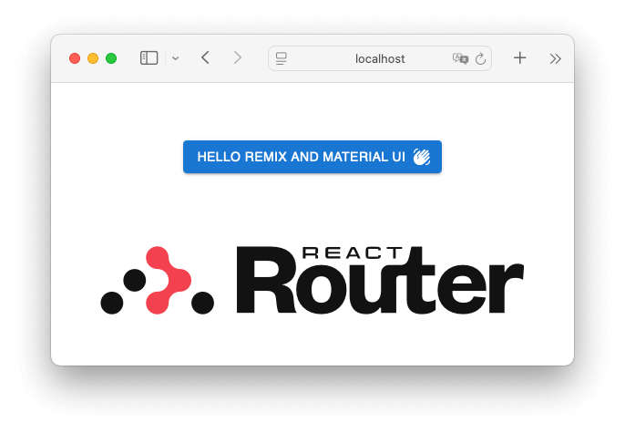

# Step 2: Start using Material UI

[^ From Scratch](./step-00-from-scratch.md)

- <https://github.com/richplastow/tryout-remix-material-ui/blob/main/docs/from-scratch/step-02-start-using-material-ui.md>

---

This step follows the
[Default Installation](https://mui.com/material-ui/getting-started/installation/#default-installation)
instructions on the Material UI website, and sticks to the default styling
engine, [Emotion.](https://emotion.sh/docs/introduction)

## Step 2-1: Install Material UI, Emotion, Roboto and the Material Icons

> [!NOTE]
> The font and icons are optional, and will add ~186 MB for ~44,000 items to
> the node_modules/ folder.

```bash
# Install Material UI and the Emotion styling engine.
npm install @mui/material @emotion/react @emotion/styled
# added 58 packages, and audited 343 packages in 5s
# 
# 58 packages are looking for funding
#   run `npm fund` for details
# 
# found 0 vulnerabilities

# Install the Roboto font.
npm install @fontsource/roboto
# added 1 package, and audited 344 packages in 2s
# 
# 59 packages are looking for funding
#   run `npm fund` for details
# 
# found 0 vulnerabilities

# Install Material Icons.
npm install @mui/icons-material
# added 1 package, and audited 345 packages in 4s
# 
# 60 packages are looking for funding
#   run `npm fund` for details
# 
# found 0 vulnerabilities
```

<!-- node_modules/ is 159,413,173 bytes (356.2 MB on disk) for 56,313 items -->

## Step 2-2 Add a Material UI Button to the home page

Open the app/welcome/welcome.tsx component, import Button and WavingHandIcon
from the new packages, and create a 'Hello Remix and Material UI' button.

> [!NOTE]
> The default React Router template uses Tailwind CSS. Using Material UI
> alongside Tailwind CSS is potentially very powerful and flexible, but it
> needs careful setup to avoid conflicts.

```tsx
import Button from "@mui/material/Button";
import WavingHandIcon from "@mui/icons-material/WavingHand";
import logoDark from "./logo-dark.svg";
import logoLight from "./logo-light.svg";

export function Welcome() {
  return (
    <main className="flex items-center justify-center pt-16 pb-4">
      <div className="flex-1 flex flex-col items-center gap-16 min-h-0">
        <Button endIcon={<WavingHandIcon />} variant="contained">Hello Remix and Material UI</Button>
        {/* ... */}
      </div>
    </main>
  );
}
// ...
```

```bash
# Run the app to see the new button.
npm run dev
# > dev
# > react-router dev
# 
#   ➜  Local:   http://localhost:5173/
#   ➜  Network: use --host to expose
#   ➜  press h + enter to show help
```

At <http://localhost:5173> you should see the new button:


